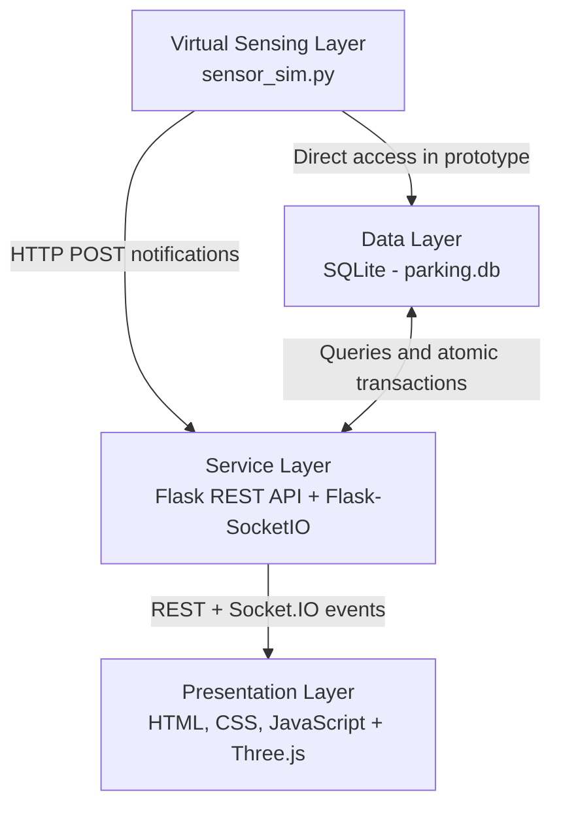
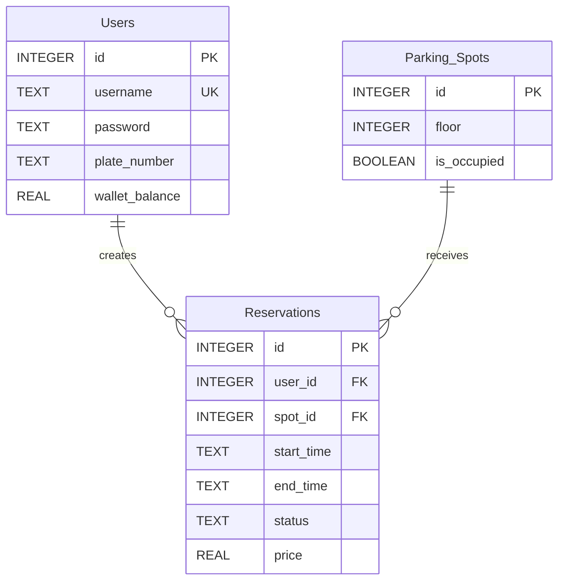

<div align="center">

# 🚗 Smart Parking Management System

### An IoT software prototype with a real-time 3D digital twin

[](https://www.python.org/)
[](https://flask.palletsprojects.com/)
[](https://socket.io/)
[](https://threejs.org/)
[](https://www.sqlite.org/)
[](#academic-context)

**Fundamentals of IoT - University of Isfahan**

[Features](#-features) •
[Architecture](#-system-architecture) •
[Quick Start](#-quick-start) •
[Demo Scenarios](#-demo-scenarios) •
[Project Report](./English_report.pdf)

</div>

---

## 📌 Overview

This project is an educational prototype of an IoT-enabled smart parking system. It simulates occupancy sensors for **10 parking spots**, manages time-slot reservations and walk-in allocation, processes wallet payments, and mirrors every state change in an interactive **Three.js 3D digital twin**.

The current version is entirely software-based. Physical microcontrollers, ultrasonic sensors, and gate actuators are represented by a Python sensor simulator and browser animations.

## ✨ Features

### User experience

- User registration and login with Werkzeug password hashing
- Wallet top-up and automatic reservation fee deduction
- Search for spots available during a selected time range
- Manual spot selection or automatic first-available allocation
- Active booking history, pre-start cancellation, and wallet refunds
- Real-time occupancy updates without frontend polling

### Parking intelligence

- Conflict-free time-slot reservations
- Prevention of overlapping bookings for both spots and users
- Atomic booking and wallet operations using `BEGIN IMMEDIATE`
- Automatic allocation of the first empty spot to walk-in vehicles
- Reservation activation, expiration, and spot release simulation
- Pre-reservation clearing of unauthorized occupancy

### 3D digital twin

- Interactive WebGL parking scene with 10 spots, roads, gates, a booth, lights, and vehicle models
- Animated `ENTRY`, `EXIT`, and `WALK_IN` vehicle states
- Sequential animation queue to reduce conflicts on shared paths
- Username labels for reserved vehicles and distinct walk-in vehicle colors
- Constrained orbit controls for safe rotation and zoom

### Administration

- Live user, reservation, occupancy, and popular-spot statistics
- Recent transaction and active reservation views
- Manual reservation creation and cancellation
- Manual virtual sensor overrides
- Live monitoring through the same 3D scene

## 🏗️ System Architecture



| Layer | Component | Responsibility |
|---|---|---|
| Sensing and simulation | `sensor_sim.py` | Generates reservations, occupancy changes, spot releases, and walk-in arrivals |
| Storage | `parking.db` | Persists users, spots, reservations, prices, and occupancy state |
| Service and application | `app.py` | Provides the REST API, booking logic, transactions, authentication, and event broadcasting |
| Presentation and digital twin | `index.html`, `style.css` | Provides user/admin workflows and the interactive 3D parking visualization |

### Real-time data flow

1. The simulator or an administrator changes a virtual sensor state.
2. The Flask backend broadcasts a `spot_status_update` Socket.IO event.
3. The browser updates the spot indicator and queues the matching vehicle animation.
4. For a walk-in arrival, the UI pauses the vehicle at the booth and requests an empty spot from `/api/bookings/on-site`.

## 🧰 Technology Stack

| Area | Technology |
|---|---|
| Backend | Python, Flask, Flask-CORS |
| Real-time communication | Flask-SocketIO, Socket.IO browser client |
| Database | SQLite |
| Frontend | HTML5, CSS3, vanilla JavaScript |
| 3D visualization | Three.js, WebGL, GLTFLoader, OrbitControls |
| 3D asset | `models/Car.glb` |
| Authentication | Werkzeug password hashing |
| Virtual IoT layer | Python background simulator |

## 🗄️ Database Model



> Walk-in reservations currently use the dedicated `WALK-IN-CUSTOMER` account. The schema does not yet contain a `booking_method` column.

## 🚀 Quick Start

### Prerequisites

- Python 3.8 or newer
- A modern browser with WebGL support
- Internet access for the Three.js and Socket.IO CDN dependencies

### 1. Install dependencies

```bash
python -m pip install -r requirements.txt
```

### 2. Initialize the database

The repository already includes a demo `parking.db`. To create or repair the schema and ensure all 10 spots exist, run:

```bash
python init_db.py
python seed_data.py
```

### 3. Start the backend

```bash
python app.py
```

The API and Socket.IO server start at `http://127.0.0.1:5000`. The sensor simulator is launched automatically as a background process, so **do not run `sensor_sim.py` separately**.

### 4. Open the frontend

Open `index.html` in a browser. If your browser restricts local module or model loading, serve the frontend locally:

```bash
python -m http.server 8000
```

Then visit `http://127.0.0.1:8000`.

### Demo admin account

```text
Username: ADMIN
Password: 1234
```

> These credentials are intentionally hardcoded for classroom demonstration and must not be used in production.

## 🔌 Main API Endpoints

| Method | Endpoint | Purpose |
|---|---|---|
| `GET` | `/api/spots` | Retrieve the complete parking state |
| `POST` | `/api/register` | Create a user account |
| `POST` | `/api/login` | Authenticate a user or administrator |
| `POST` | `/api/search_spots` | Find non-conflicting spots for a time range |
| `POST` | `/api/reserve` | Reserve a selected spot |
| `POST` | `/api/auto_reserve` | Reserve the first available spot |
| `POST` | `/api/bookings/on-site` | Allocate a spot to a walk-in vehicle |
| `POST` | `/api/wallet/topup` | Add funds to a user wallet |
| `GET` | `/api/user/reservations/<user_id>` | List a user's active reservations |
| `POST` | `/api/user/cancel_reservation/<reservation_id>` | Cancel and refund a future reservation |
| `GET` | `/api/admin/analytics` | Retrieve dashboard statistics |
| `POST` | `/api/admin/sensor_spot` | Override a virtual sensor state |

## 🧪 Demo Scenarios

| # | Scenario | Expected result |
|---:|---|---|
| 1 | Register and log in | A hashed account is created and the user dashboard opens |
| 2 | Reserve with insufficient funds | The request is rejected with a wallet warning |
| 3 | Top up and reserve | The fee is deducted and the reservation is committed |
| 4 | Attempt a conflicting booking | The overlap check rejects the duplicate booking |
| 5 | Reach a simulated start time | Occupancy changes and the entry animation runs |
| 6 | Trigger a walk-in arrival | The vehicle stops at the booth and receives the first empty spot |
| 7 | Override a sensor as admin | The database, indicator light, and 3D scene update in real time |
| 8 | Complete or cancel a booking | The spot is released and the exit animation runs |

## ⚠️ Prototype Boundaries

| Current prototype | Production direction |
|---|---|
| Python-based virtual sensors | ESP32/ESP8266 nodes with ultrasonic or IR sensors |
| HTTP notifications and direct SQLite access | MQTT broker between edge devices and backend |
| Local SQLite database | PostgreSQL or another server-grade database |
| Static spot coordinates in backend/frontend code | Central configuration or database-driven coordinates |
| Hardcoded admin credentials | Environment-based secrets, JWT, and role-based access control |
| Late-fee message only | Automated penalty calculation and deduction |
| Manual local startup | Docker Compose deployment |

The recommended industrial telemetry path is:

```text
Sensor / ESP32 -> MQTT Broker -> Backend -> Database -> Socket.IO Dashboard
```

## 📁 Project Structure

```text
.
├── app.py                 # Flask API, business logic, and Socket.IO server
├── sensor_sim.py          # Virtual sensing and traffic simulation
├── init_db.py             # Database schema initialization
├── seed_data.py           # Initial 10-spot dataset
├── parking.db             # SQLite database
├── index.html             # SPA and Three.js digital twin
├── style.css              # Interface styling
├── models/
│   └── Car.glb            # 3D vehicle model
├── requirements.txt       # Python dependencies
└── English_report.pdf     # Full academic project report
```

## 🎓 Academic Context

**Course:** Fundamentals of Internet of Things<br>
**University:** University of Isfahan, Department of Computer Engineering<br>
**Authors:** Parham Kiyoumarsi and Amirhossein Saleh<br>
**Professor:** Dr. Mohammadhossein Bateni<br>
**Report date:** July 24, 2026

For the complete design rationale, implementation details, evaluation plan, and future work, read the [full English project report](./English_report.pdf).

---

<div align="center">

Built as a practical bridge between virtual sensing, backend intelligence, and real-time visualization.

</div>
